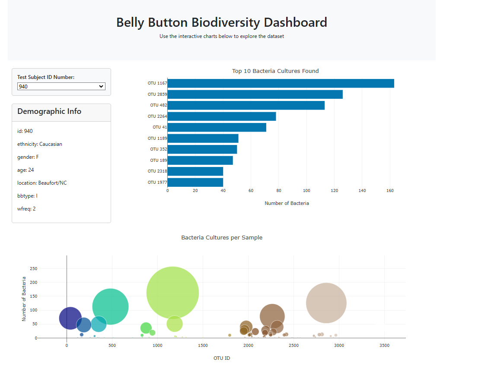

# Belly Button Biodiversity Dashboard

## Project Overview

This project is an interactive dashboard that explores the Belly Button Biodiversity dataset, which catalogs the microbes that colonize human navels. The dataset reveals that a small handful of microbial species were present in over 70% of individuals, while the majority were relatively rare.

## Features

### Dynamic Dropdown Menu: 
Users can select an individual ID to explore their microbial composition.

### Interactive Bar Chart: 
Displays the top 10 OTUs found in the selected individual's navel.

### Bubble Chart: 
Visualizes the relative abundance of microbial species.

### Responsive Design: 
Updates charts and metadata dynamically when a different individual is selected.

## Dataset

The data used in this project comes from the Belly Button Biodiversity study. It includes (a few to list that is used in the analysis) :

Metadata, Names, Samples, OTU IDs and their corresponding taxonomic classifications, OTU sample values for each individual

## Technologies Used

HTML, CSS, JavaScript, D3.js

Data Processing: JSON

Visualization: Plotly.js

## Dashboard Preview

Deployment: GitHub Pages 
https://lovecy86.github.io/belly-button-challenge/